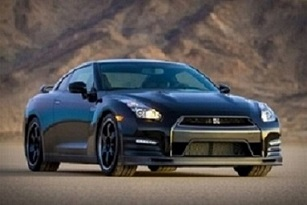

## BEST CAR AVARD      GT-R 


You  can use this link for search any car or thing on [google](https://www.google.com).


### BEST CAR OF 3 YEARS - NISSAN SKYLINE GT-R


```markdown

The first cars named **"Skyline GT-R"** were produced between 1969 
and 1972 under the model code KPGC10, and enjoyed legendary success
in local Japanese touring car racing. This model was followed by a 
brief production run of second-generation cars, under model code 
KPGC110, in 1973. After a 16-year hiatus, the GT-R name was revived 
in 1989 as the BNRR32 ("R32") **Skyline GT-R**.
```
## MOTOR-SPORT
```
The GT-R's history of racetrack dominance began with its 50 victories
scored from 1968 to 1972, including 49 consecutive wins in the Japanese
race circuit. Nissan pulled out of racing shortly after the release of 
the KPGC110.


The **Skyline GT-R** later earned the nickname **"Godzilla"**, as a play
on its **"monster"** track performance and country of origin. 
The **R32 GT-R** dominated JTCC, won all 29 races it entered in the
series, as well as taking the series title every year from 1989 to 1993.

```

 
           

